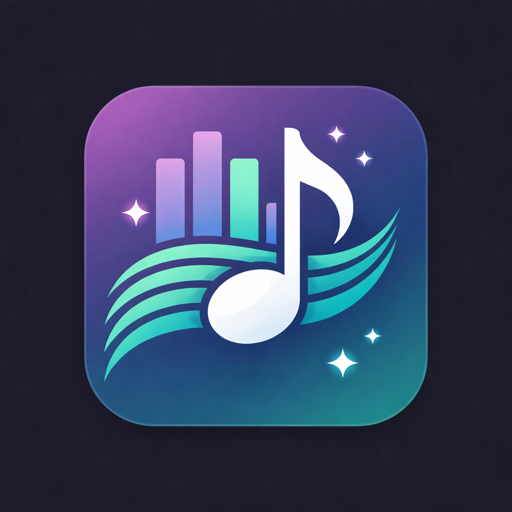
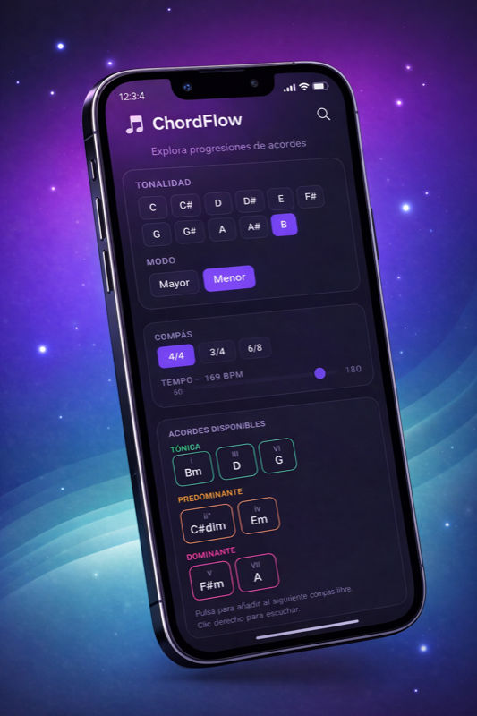

<p align="center">
  
</p>

<h1 align="center">ChordFlow</h1>

<p align="center">
  A mobile-first Progressive Web App for building, testing and listening to chord progressions in seconds.
</p>

<p align="center">
  <a href="https://chordflow-delta.vercel.app">Live Demo</a>
</p>

<p align="center">
  
</p>

---

ChordFlow is designed as a harmonic sketchpad for songwriters, producers and musicians who want to explore chord combinations quickly without opening a full DAW or diving into heavy music theory tools.

## What it does

ChordFlow helps you:

- Choose a key and mode
- Set a time signature and tempo
- Browse diatonic chords grouped by harmonic function (tonic, predominant, dominant)
- Build an 8-bar chord progression by tapping chords
- Replace or clear chords from any bar
- Play the progression back with a synth-based sound
- Loop the progression for continuous listening
- Apply preset suggestions (stable cadence, classic pop, tension, melancholic)
- Use it comfortably on mobile thanks to its PWA-first design

## Why ChordFlow

Most music tools fall into two extremes:

- too simple to be useful
- too complex for quick creative exploration

ChordFlow sits in the middle.

Its goal is not to replace a DAW or become a full theory platform.
Its goal is to make harmonic experimentation fast, tactile and inspiring.

## Current MVP features

- Mobile-first dark interface optimized for touch
- Installable PWA with offline support
- 12 keys with major and natural minor modes
- Time signatures: 4/4, 3/4, 6/8
- BPM control (60–180)
- 8-bar progression timeline with visual playback feedback
- Diatonic chords grouped by harmonic function
- Preset progression suggestions
- Tone.js-based audio engine
- LocalStorage persistence

## Tech stack

- React
- Vite
- TypeScript
- Tone.js
- CSS Modules
- vite-plugin-pwa

## Getting started

```bash
git clone https://github.com/JMFernandez82/ChordFlow.git
cd ChordFlow
npm install
npm run dev
```

Open http://localhost:5173 in your browser.

## Project structure

```
src/
  components/   # UI building blocks
  data/         # suggestions and musical presets
  hooks/        # state management and audio hooks
  lib/          # music theory engine and Tone.js wrapper
  types/        # shared TypeScript types
  App.tsx       # main app container
  main.tsx      # entry point
```

## Roadmap

Planned for future versions:

- Seventh chords and extended harmonies
- Chord inversions
- Additional modes (dorian, mixolydian, etc.)
- MIDI export
- Advanced harmonic suggestions
- More than 8 bars
